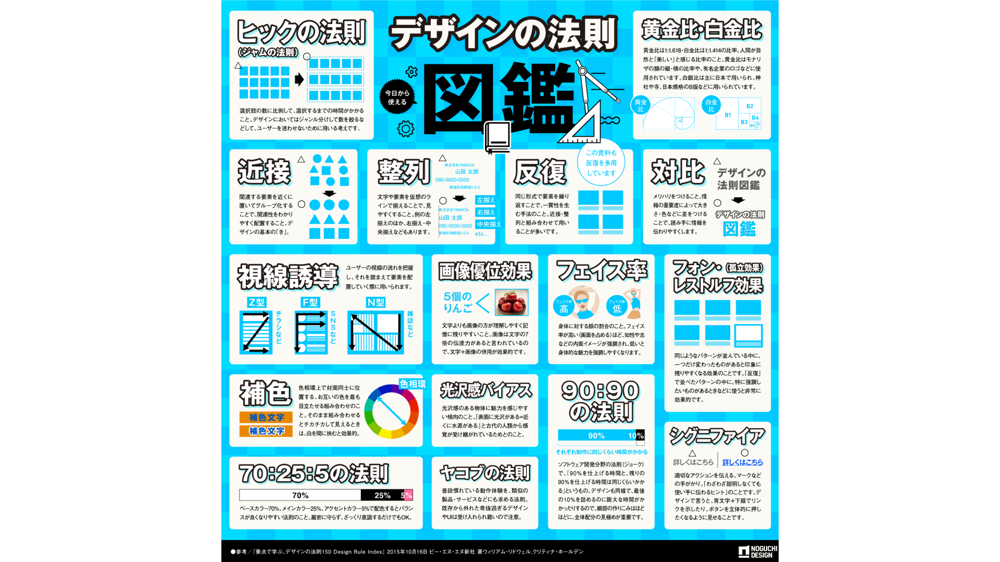
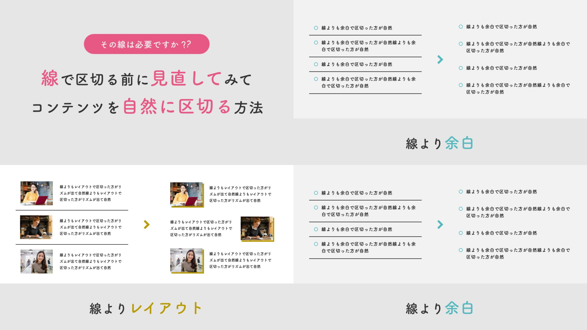
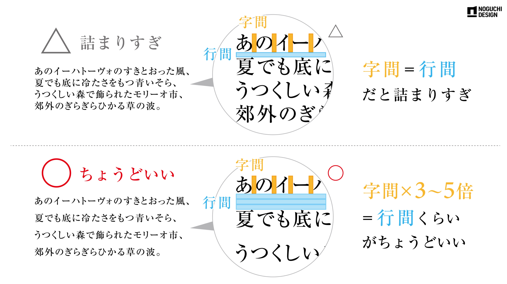

# レイアウト
## デザインの法則集

- 参考：https://x.com/n_seitan/status/1835659374678925524

## 線をひく前に検討する3つ

- 参考：https://x.com/pulpxstyle/status/1666415603295617025

## 読みやすい「行間」の決め方

- 参考：https://x.com/n_seitan/status/1715353863929377101